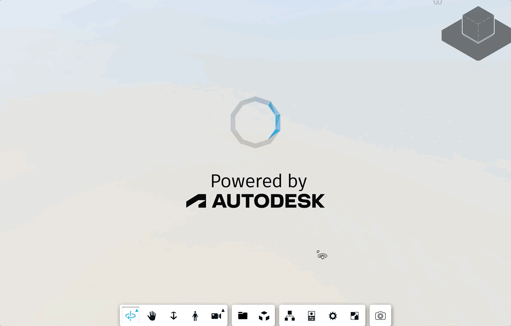
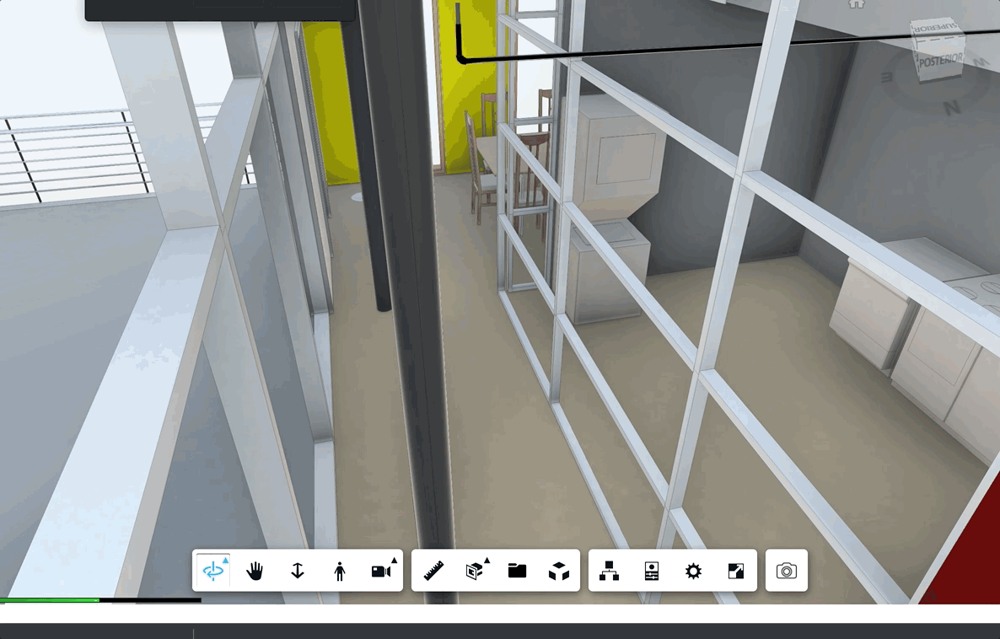

# aps-viewer-rooms-screenshots
APS Rooms Screenshots sample: Sample to generate screenshots from rooms from a Revit design in Viewer context

## THIS IS A WORK IN PROGRESS

### DEMO: 

### Introduction

Lets say you need to generate images of your scene at specific orientations. The commom way would be prompting the user to walk through the model, properly orienting the camera ang generating some images. In specific contexts, we can automate this workflow to generate these images using Viewer methods such as [setView](https://aps.autodesk.com/en/docs/viewer/v7/reference/Viewing/Navigation/#setview-position-target) and [getScreenShot](https://aps.autodesk.com/en/docs/viewer/v7/reference/Viewing/GuiViewer3D/#getscreenshot-w-h-cb-overlayrenderer). This is what we'll cover in this sample, in this case focusing on generating automatic images of rooms.



### The approach

We are basically take advantage of the methods used by Eason's [moving camera to rooms blog](https://aps.autodesk.com/blog/move-viewers-camera-rooms) in the  in order to list and obtain bounding boxes and names from the rooms available in the scene, just like in the snippet below:

```js
async getRoomData() {
  const getRoomDbIds = () => {
    return new Promise((resolve, reject) => {
      this.viewer.search(
        'Revit Rooms',
        (dbIds) => resolve(dbIds),
        (error) => reject(error),
        ['Category'],
        { searchHidden: true }
      );
    });
  };

  const getPropertiesAsync = (dbId) => {
    return new Promise((resolve, reject) => {
      this.viewer.getProperties(
        dbId,
        (result) => resolve(result),
        (error) => reject(error),
      );
    });
  }

  const data = [];

  try {
    const roomDbIds = await getRoomDbIds();
    if (!roomDbIds || roomDbIds.length <= 0) {
      throw new Error('No Rooms found in current model');
    }

    for (let i = 0; i < roomDbIds.length; i++) {
      const dbId = roomDbIds[i];
      const propData = await getPropertiesAsync(dbId);

      data.push({
        id: propData.externalId,
        dbId: dbId,
        name: propData.name
      });
    }

  } catch (ex) {
    console.warn(`[RoomListPanel]: ${ex}`);
    throw new Error('Failed to extract room data');
  }

  return data;
}

async getBoundingBox(dbId) {
  const model = this.viewer.model;
  const it = model.getInstanceTree();
  const fragList = model.getFragmentList();
  let bounds = new THREE.Box3();

  it.enumNodeFragments(dbId, (fragId) => {
    let box = new THREE.Box3();
    fragList.getWorldBounds(fragId, box);
    bounds.union(box);
  }, true);

  return bounds;
}
```

With that, we can loop through the rooms (waiting for the transition to finish) to generate each image.




### Limitations

For this workflow to work, your Revit file needs to be converted generating the master views (that contains the rooms information).
You can find that explained in [this lightning talk](https://youtu.be/GgW9gBCRrWg?t=232).
Also, for it to load the master view first, we're using a trick, just like in the snippet below:
```js
function findMasterViews(viewable) {
  var masterViews = [];
  // master views are under the "folder" with this UUID
  if (viewable.data.type === 'folder' && viewable.data.name === '08f99ae5-b8be-4f8d-881b-128675723c10') {
    return viewable.children;
  }
  if (viewable.children === undefined) return;
  viewable.children.forEach((children) => {
    var mv = findMasterViews(children);
    if (mv === undefined || mv.length == 0) return;
    masterViews = masterViews.concat(mv);
  })
  return masterViews;
}
```

Since the execution generates one image for each room, you'll need to allow this app to download all these files.
